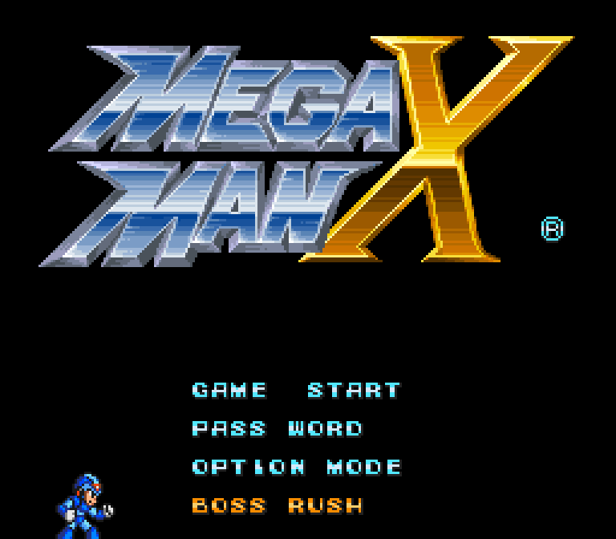
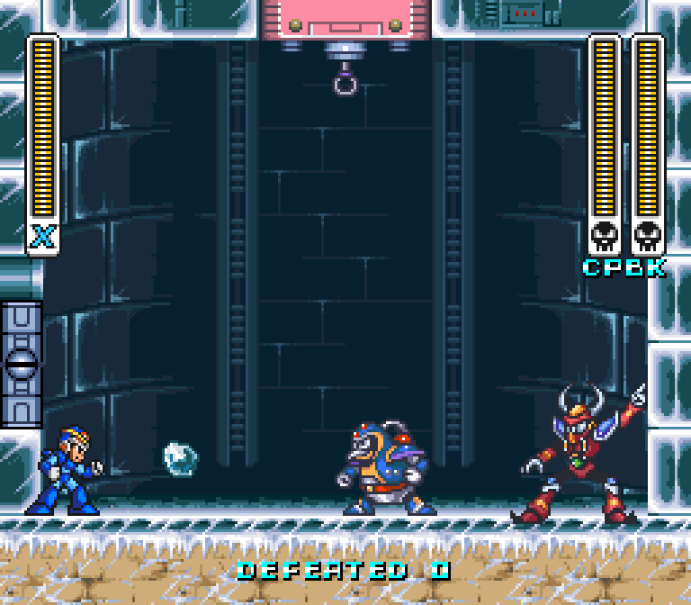
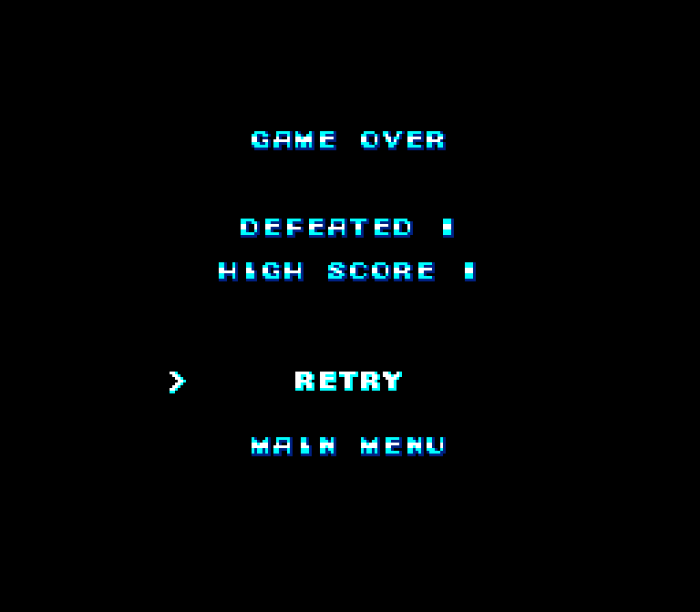
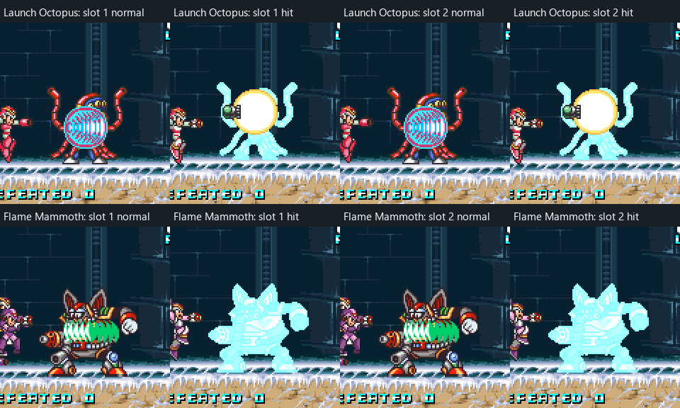
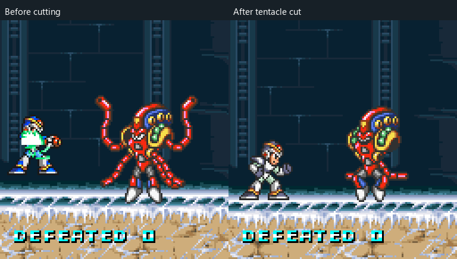
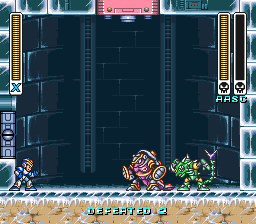
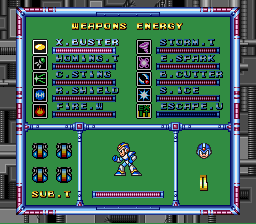
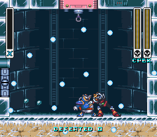

# Endless Boss Rush

Boss Rush adds a fourth entry to the USA game's title menu. It starts directly
in solo or co-op according to the launcher's existing X + Zero mod setting.
Co-op uses that mod's owner-supplied X3 assets.
The arena starts with full health, all native X1 weapons, maximum health and
armor, and four full **shared** Sub Tanks; Hadouken is not acquired. There are no automatic refills or
revivals. Two different Mavericks remain present, with each defeated boss
replaced after cleanup. A run ends when its last player dies.
The native player death animation finishes before results appear.

Select **Boss Rush** beneath **Option Mode**. Enable the launcher's existing
co-op mod and supply its X3 ROM to play together. Two native meters on the right
identify each boss by initials; the shared defeat
counter sits below the arena floor. Boss meters, initials and the counter
are hidden while the weapon menu is open. The black **Game Over** page uses native font tiles
with blue/cyan shading, shows the final defeat count and high score, and offers
**Retry** and **Main Menu**. The best score persists locally across runs and
launches in `mmx-boss-rush-score.dat` beside the executable. It is local results
metadata and does not affect gameplay snapshots or rollback.

## Screenshots

These images come from playtest9 native ROM-backed runs. Full frames are
enlarged with nearest-neighbor scaling; the hit and cut comparisons use labeled
crops. The fixtures select pairs and position projectiles for repeatable checks.
The Game Over score is an example from the results fixture.

Native title entry:

Penguin and Kuwanger in the enclosed arena with two native boss meters:

Native font, final count, persistent high score and retry choices:

Weakness-hit flashes in both boss slots, including Mammoth's trunk:

Octopus before and after his native tentacle cut; the small walking limbs remain:

Playtest10 keeps Armadillo's original colors after both previous bosses die
together, and preserves X's centered idle preview in the native pause menu:

Native death orbs continue after the body burst, with the inactive armor removed:

## Runtime ownership

`MmxBossRushState` owns the deterministic shuffled queue, defeat counter,
encounter phases and boss-owned child objects. Unavailable bosses carry into
the next shuffle; a boss that survives a long time cannot block replacements
or produce a duplicate. The opening shuffle mixes native RNG/NMI timing and
the previous queue RNG,
so confirmation timing and Retry vary the opening pair while snapshot replay
retains the same encounter. Snapshot chunk v20 includes all run state, native
effect requests and camouflage colors, including an interrupted actor call.
Chunk v19 has effect requests without private palette history. Chunk v18 retains
Boss Rush with no pending audio cues; saves before v18 load with Rush inactive.
Renderer captures v20/v21 preserve solo/co-op runs, their HUD and private
camouflage colors; v18/v19 captures remain readable.

Native controllers advance once in the existing enemy loop. Entrances retain
their animation and native health-fill states; mode hooks suppress player
scripting and contain scene/camera flags within that actor's call. The native
global victory/death effect is replaced by a local cleanup interval. Each
boss's child actors belong to its encounter; cleanup preserves the other
boss, its children, and both players' projectiles.

The run loads Chill Penguin's last native checkpoint between the boss doors.
Players can prepare weapons there; crossing the second door scrolls into the
enclosed room and starts the encounter and boss music. Door, checkpoint and
camera events remain active during preparation; stock stage enemies are
filtered before allocation. Because Rush bypasses the stock boss's shared
player intro, the encounter requests battle song `$1E` through the native dispatcher
after the door releases; it uploads the SPC bank and supports the existing
MSU1 hook. The call stays inside the guest scheduler so an upload can yield
across frames. Its saved registers live on the guest stack and its pending
return is snapshot-owned, with the existing state layout preserved.
This matches Chill Penguin's health-fill controller at `$81:B617`; `$21`
is the victory song and must not be used for the encounter.
The room retains native scenery,
metatile collision data and its fixed camera. Kuwanger
starts higher to finish his native downward entrance above that floor. Mammoth
uses a fixed arrival position and bypasses the factory's player-distance gate;
his native entrance animation and health-fill states still run.

The title entry uses the native BG3 font and selection palettes. Confirmation
plays the native mini charged shot on the selected fourth row before the fade;
held confirmation buttons are consumed until released so they do not fire
again after arrival. Boss meters
reuse the game's original frame, overlapping energy strips and skull footer;
the counter, initials and results also use native font tiles. Weakness hits
that immediately advance an arriving boss into a hurt/death state still count
the defeat and schedule a replacement.
Graphics resources are decompressed once from the owner's ROM when it is
assigned to the renderer and cached in process memory. Owned bosses render
their own stage's resource, palette and pose DMA remapping privately. Their
native shared OBJ uploads and palette copies are suppressed so cross-stage
actors cannot overwrite X, weapons or another boss. No decoded graphics or
ROM-derived cache files are distributed with the build.

Boss attack sounds are rendered ahead of play using an isolated copy of the
native SPC/DSP, loaded from the owner ROM's common banks `$00/$01/$02` and the
battle instrument overlays `$42/$47`. All 31 observed boss/child attack effects
are cached in process memory. The original driver assigns these effects to
three fixed voices with priorities: Kuwanger's boomerang `$5A` has lower
priority than `$51`, so an overlapping request can be acknowledged and remain
silent. Cached effects use the existing trusted-mod PCM mixer to overlap
independently. Native signed request positions determine left/right balance.
The boomerang cache retains its full native sustain, with a five-second
render bound; playback stops when its emitting object retires. Music, player
sounds, meter fill, charge/stop and transfer commands retain their native path.
Attack requests substitute acknowledged null effect `$B1` in the existing ring
so producer/consumer timing and the SPC handshake remain intact. Snapshot-owned
cues are delivered only for the committed frame. Co-op ghost passes discard
their speculative cues; rollback preserves existing mixer voices and their
playback positions. Ordinary save-state loads and reset stop old voices.
An unavailable cached effect keeps its original native sound request.
No PCM, BRR data or other ROM-derived audio files are distributed.

After a fatal hit, owned bosses cannot deliver further contact damage to the
projected player at zero HP. Native grab, throw-damage and grab-release helpers
also preserve the death pose at zero HP. This prevents a surviving boss from
repeatedly resetting the native death controller and replaying its sound.

## Disassembly references

The imported names are useful discovery aids, not verified function contracts.
The authoritative class dispatch at `$80:F8DD` identifies these boss bodies:

| Boss | Class | Controller | Native resource stage |
| --- | --- | --- | --- |
| Chill Penguin | `$02` | `$81:B516` | 8 |
| Spark Mandrill | `$31` | `$88:9BE1` | 6 |
| Armored Armadillo | `$14` | `$83:B144` | 3 |
| Launch Octopus | `$07` | `$81:C433` | 1 |
| Boomer Kuwanger | `$05` | `$87:8A7E` | 7 |
| Sting Chameleon | `$0A` | `$88:853E` | 2 |
| Storm Eagle | `$52` | `$87:D85C` | 5 |
| Flame Mammoth | `$0C` | `$87:91A7` | 4 |

The imported Octopus/Kuwanger main labels name related actors. The common
entrance player script is `$84:9FEB`; script release is `$84:A003`; the
already-defeated guard is `$84:AADD`. Native death `$84:A677` starts global
freeze/palette/victory work and cannot run unchanged beside another boss.
The original HUD follows only the object pointer at `$7E:1F0E`.

## Arena authoring tools

- [TeheMan X Editor](https://github.com/Kuumba123/TeheManX_Editor): documents
  X1-X3 support on Windows/Linux/macOS. Its level, enemy, camera-trigger,
  checkpoint and graphics-setting code can help construct a more detailed
  arena and interpret native room data.
- [MegaEdX](https://github.com/Xeeynamo/MegaEdX): another SNES Mega Man X
  level editor and a reference for native stage editing.

Use a private ROM copy for editor experiments. Keep arena modifications
reproducible in source; editor-produced ROMs are not repository artifacts.
Neither editor establishes that native boss controllers can coexist safely.

## Validation

`mmx_boss_rush_test` exercises long replacement runs, duplicate exclusion,
shuffle fairness, deterministic state restore, invalid state rejection and overlay
drawing without a ROM. Build `mmx_state_tests` with `MMX_STATE_TESTS=ON`, then
set `MMX_BOSS_RUSH_TEST=1` and pass the verified USA ROM to run the title-menu,
28-pair entrance, replacement, 600-frame combat and snapshot-replay checks in
an empty private working directory. Add `MMX_BOSS_RUSH_COOP=<private Zero asset
file>` to run those checks in local co-op, including one-player and team deaths.
The same checks verify the native title projectile, second-door controller and
actual boss music bank upload against the command in the original Penguin
controller, then exercise Retry and Main Menu. If an upload
spans frames, the fixture also checks snapshot replay while it is suspended. Portable
checks also cover results-page isolation from death flashes/HUD and high-score
persistence, monotonic records and rejection of malformed files. The compatibility pass holds
player HP full to isolate boss behavior. Each pair must create a new boss
generation after cleanup. Additional checks use native Fire Wave and Homing
Torpedo finishing hits against Penguin and Kuwanger (fixtures start at 1 HP),
and cover entrance-to-hurt/death transitions.
Set `MMX_BOSS_RUSH_DEATH_TEST=1` for a fatal native-contact regression;
`MMX_BOSS_RUSH_DEATH_BOSS=4` selects Kuwanger instead of Penguin. It requires
the actual death animation to reach Game Over and emit exactly one `$0A`
request. Set `MMX_BOSS_RUSH_AUDIO_TEST=1` to compare cached PCM with independent
native SPC output, reproduce priority rejection, verify concurrent mixing,
confirm local rollback retains voices and playback positions, and verify that
an ordinary save-state load stops them. These checks do not establish
gameplay balance or long-session stability.

Online uses the existing co-op transport and serialized game state. Per the
owner's direction, this feature relies on the engine's existing netplay
validation; no new two-peer test is required for this change.

Owner playtest priorities: try every native weapon, spend shared Sub Tanks,
fight repeated replacements, and check both players can move and attack while
a replacement enters. Watch boss grabs, rolling/airborne attacks and child
objects near walls. Check pause/menu behavior, boss art and hit feedback, and
death followed by Retry/Main Menu. The flat arena and spawn positions are the
initial layout; balance and presentation can be tuned after that playtest.

## Rolling graphics and camouflage

Armadillo's standing body uses animation `$62` / resource `$5D`; his rolling
attack switches to animation `$63` / resource `$5E`, with tile base `$40`.
The enemy animation table only contains the standing binding. Boss Rush
resolves the second resource from his original boss-room section, retaining
all four native rotation arrangements instead of borrowing Penguin's VRAM.

Chameleon's native `$88:8DAB` / `$88:8E0F` helpers restore or darken each RGB5
channel by one step. Their original `$0480` / `$04A0` palette buffers and BG2
HDMA task are shared stage resources. Rush maintains private palette history
at those exact native calls and applies additive camouflage only to his body.
It suppresses his shared palette writes and arena-wide BG2 HDMA while keeping
his native phase counter, animation sequences, movement and attack timing.
Private colors are serialized in game chunk v20 and render captures v20/v21;
older game chunks and captures remain readable.

Set `MMX_BOSS_RUSH_VISUAL_TEST=1` alongside `MMX_BOSS_RUSH_TEST=1` to exercise
all four original rolling frames and a native disappear/reappear cycle, check
bounded RGB steps and complete palette restoration, and restore a snapshot
mid-fade. This fixture selects the original camouflage behavior directly to
avoid depending on an RNG decision; it never substitutes host animation timing.

## Boss attack graphics validation

Rush binds the separate native sheets for Octopus's tornado (`$77` / `$6B`),
Eagle's dive (`$8A` / `$83`) and Penguin's statues (`$68` / `$62`). Eagle's
standing and extended wings stay on `$89` / `$82`; his retained dive-DMA
metadata must not overwrite that static sheet. Native pose DMA applies only
when its resource matches the actor's selected sheet. Reused projectile slots
cannot apply stale DMA to a different boss's static graphics.

Penguin's ice beads, breath and shatter keep their original `$61` tile sheet
but select the separate `$62` ice palette, as their native helpers do. Eagle's
egg/chick uses the second palette in `$016E`. Mandrill's electric orb, dash
flash and charged body use the appropriate banks of the four-palette `$01D2`
list. These selections are private renderer data and retain native object
flips, arrangements and animation timing.

Two bosses and their child effects can exceed the retail 112 gameplay OBJ
slots. Rush renders complete arrangements from the existing native priority
queues even when the general sprite-expansion option is disabled. The native
weapon menu retains its original rendering. No guest OAM, VRAM or CGRAM is
rewritten by this presentation path.

Set `MMX_BOSS_RUSH_AIR_VISUAL_TEST=1` alongside `MMX_BOSS_RUSH_TEST=1` for a
native Octopus/Eagle run that requires all 16 tornado expansion poses, all
three extended-wing poses and both dive poses on screen. It saves private
captures and a controller trace for review.

Set `MMX_BOSS_RUSH_FORCE_VISUAL=7,1` for Mammoth/Mandrill or `=5,0` for
Chameleon/Penguin. Each fixture restores a clean snapshot before selecting
substate zero in every verified native combat controller: four Mammoth, six
Mandrill, seven Chameleon and six Penguin behaviors. The original code then
advances for 420 frames per behavior. Assertions require private graphics for
every observed body/effect and explicit coverage of Mammoth's trunk/fire/oil,
Mandrill's orb/charged body, Chameleon's tongue/spikes, and Penguin's beads,
breath and statue growth. The current pass records 169 distinct animation/pose
combinations across those four bosses. Private sprite sheets and gameplay
images are reviewed visually; the assertions establish coverage and resource
binding rather than a complete gameplay or pixel-reference comparison.

The forced runs, native air/fade checks, seven portable checks, all 28 boss
pairs in Add Zero solo and local co-op, and ordinary save/load, replay, rewind,
legacy-v2 and fresh-process replay pass on playtest9. ROMs, decoded asset caches,
raw render captures and save data remain private. Selected PNG screenshots
are published above. Owner gameplay review remains pending.

## Native damage flashes and severed limbs

The native `$82:827D` setup reads OBJ tile/palette allocations from the current
room. Penguin's room has no allocation for most other Mavericks; Octopus and
Mammoth therefore saved palette zero as their normal damage palette in `$33`.
Rush supplies each owned object's original resource allocation at the two
stores, after the original loads execute. Native bus reads, cycle timing,
damage counters and collision boxes are preserved. Mandrill's dash palette
selection also accepts the resulting original palette-4 OR `$06` value.

Private boss graphics now respect the native palette-zero damage flash using
live CGRAM, while retaining their own decoded tiles. Mammoth's trunk copies
his palette natively and flashes with his body. This applies to either seat.

Octopus's third accepted Boomerang Cutter hit sets the native severed flag at
`+$36`, selects the cut animation sequences and disables vortex choices. The
original cut arrangements retain his two small walking limbs; the large arms
and tentacles are removed. Rush keeps those original arrangements.

Set `MMX_BOSS_RUSH_HIT_VISUAL_TEST=1` alongside `MMX_BOSS_RUSH_TEST=1` to swap
Octopus and Mammoth between both seats and hit them with real native Rolling
Shield, Storm Tornado and Boomerang Cutter projectiles. The fixture isolates
contact/grabs and positions shots to guarantee collisions; damage acceptance,
native immunity, palette phases and severing execute in the original code.
It saves private normal/flash images, observed animation sheets and a damage
trace. The spacing assertion checks that accepted repeat hits cannot bypass
the native 60-frame immunity; it does not establish whether every moving
attack's visible pixels match its original collision box.

The playtest9 hit run passes all eight boss/seat/weapon combinations. Private
gameplay captures show Octopus's normal and flashing palettes in both seats
and Mammoth's body/trunk flashing together in both seats. Cut traces reach
Octopus's severed flag and Mammoth's zero trunk counter after three accepted
Boomerang Cutter hits. Reviewed cut arrangements match the original ROM art.

## Armadillo entrance palette and native pause preview

Armadillo's entrance reads `$7F:835D` again at `$83:B18C`, after the shared
OBJ initializer. In Penguin's room that overwrote his corrected palette with
zero, which the private renderer interpreted as a hit flash throughout the
fight. Rush now supplies his original allocation before `$83:B192` stores it;
the original load, mask and saved normal palette at `+$35` still execute.
The replacement fixture kills both bosses in one frame and checks Armadillo
in either slot, including snapshot restoration.

The native weapon menu clears its camera at `$80:C466` before installing
its HUD/HDMA flags, and can yield during that opening transition. Rush preserves
that zero origin through the opening, paused screen and closing transition.
Its arena camera resumes when the native game restores the stage origin.
The pause fixture starts after movement and shooting, compares against the
native menu from the same combat snapshot with Rush disabled, and checks
save/restore and returning to the arena. Run these fixtures with
`MMX_BOSS_RUSH_REPLACEMENT_VISUAL_TEST=1` or
`MMX_BOSS_RUSH_PAUSE_VISUAL_TEST=1`, alongside `MMX_BOSS_RUSH_TEST=1`.

## White armor remnants after death

The native player death burst at `$81:8AAA` disables armor objects `$0C38`,
`$0C58` and `$0C78` without clearing their visibility bytes at `+$0E`.
With Add Zero installed while playing X, snapshot/fade reconstruction treated
those bytes as sufficient to rebuild nine dormant armor pieces. Rush's expanded
sprite list drew them in the native white death palette after X disappeared.

Reconstruction now requires each armor object's active byte, matching native
submission. Already recorded pieces retain their OAM epoch, so legitimate
death poses, blink gaps and menu fades still render correctly. The portable
pixel fixture checks all three active/inactive armor objects in the center
and widescreen margin. `MMX_BOSS_RUSH_DEATH_TEST=1` with
`MMX_BOSS_RUSH_TEST=1` captures the native fatal-contact sequence before and
after the body burst, checks one death-sound request and reaches Game Over.
Reviewed playtest10 captures show the original death orbs with no retained armor.
